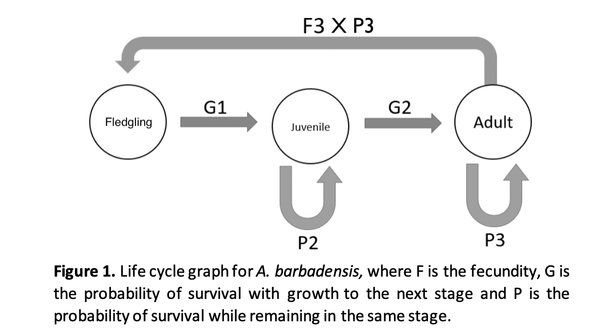

```{r setup, include=FALSE}
knitr::opts_chunk$set(echo = TRUE)
```

We model a parrot life cycle with "Post+" census type [@kendall_persistent_2019] in which the
first stage commences after fledging.



## References

<!-- Auto-generated -->